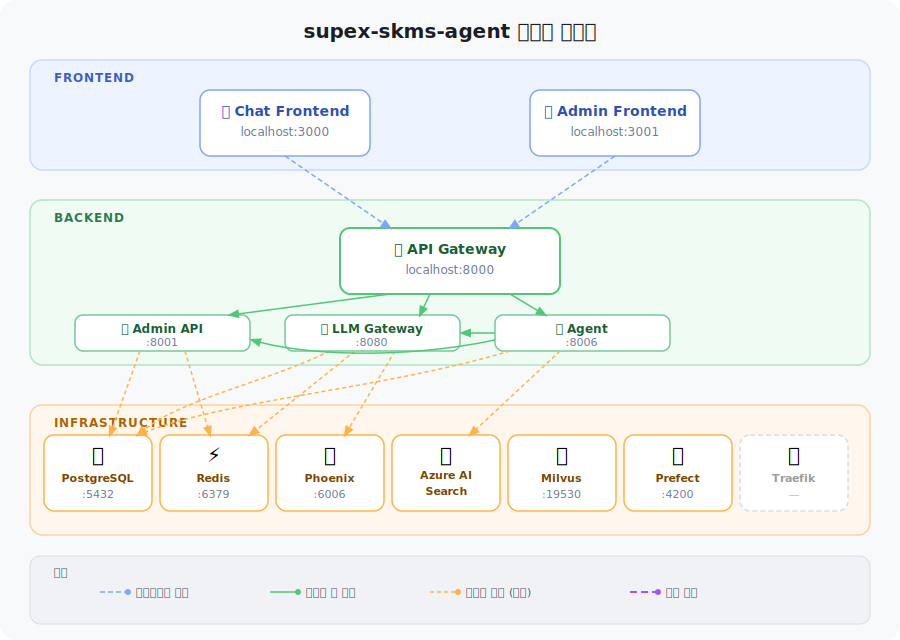

# supex-skms-agent

**SKMS(SK 지식관리시스템) 기반 AI Agent 서비스 플랫폼**

SK그룹의 지식관리시스템(SKMS)을 활용한 AI Agent 서비스를 제공하는 멀티 레포 프로젝트입니다.
LLM 기반 에이전트가 SKMS 지식 체계를 검색·분석·활용하여 업무 생산성을 높입니다.

## 아키텍처



## 서비스 구성

| 서비스 | 포트 | 설명 |
|--------|------|------|
| **gateway** | 8000 | 인증 + API 라우팅 게이트웨이 |
| **admin** | 8001 | 인증/사용자/조직/AI리소스 관리 |
| **llm-gateway** | 8080 | LLM 배포/관리/서빙 |
| **agent** | 8006 | RAG/Mentor 에이전트 서비스 |
| **frontend/chat** | 3000 | 채팅 프론트엔드 |
| **frontend/admin** | 3001 | 관리자 프론트엔드 |

## 레포지토리

| 레포 | 설명 |
|------|------|
| [shared-infra](https://github.com/supex-skms-agent/shared-infra) | 공통 인프라, 개발 표준, K8s 매니페스트 |
| [gateway](https://github.com/supex-skms-agent/gateway) | API Gateway (인증 + 라우팅) |
| [admin](https://github.com/supex-skms-agent/admin) | 관리자 API (Feature-first 구조) |
| [llm-gateway](https://github.com/supex-skms-agent/llm-gateway) | LLM 배포/관리/서빙 서비스 |
| [agent](https://github.com/supex-skms-agent/agent) | AI Agent 서비스 |
| [web-admin](https://github.com/supex-skms-agent/web-admin) | 관리자/채팅 프론트엔드 |
| [infra-prefect](https://github.com/supex-skms-agent/infra-prefect) | Prefect 워크플로우 오케스트레이션 |
| [infra-phoenix](https://github.com/supex-skms-agent/infra-phoenix) | Phoenix LLM 트레이싱/모니터링 |
| [infra-milvus](https://github.com/supex-skms-agent/infra-milvus) | Milvus 벡터 데이터베이스 |

## 빠른 시작

```bash
# 1. shared-infra 클론
git clone https://github.com/supex-skms-agent/shared-infra.git
cd shared-infra

# 2. 개발 환경 초기 셋업 (최초 1회)
./scripts/developer-setup.sh

# 3. 로컬 인프라 실행 (PostgreSQL + Redis)
docker compose -f docker-compose.dev.yml up -d
```

자세한 내용은 [개발자 가이드](https://github.com/supex-skms-agent/shared-infra/blob/main/docs/DEVELOPER_GUIDE.md)를 참고하세요.
